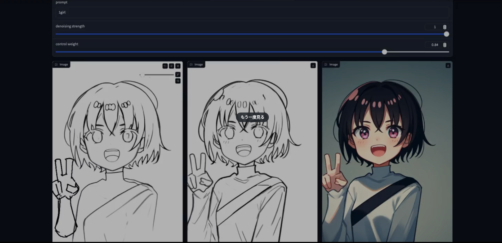

# LCM-LoRA Realtime drawing demo
This is a demo script for real-time drawing of LCM-LoRA.
By dragging the middle line drawing to the input, the result of the output can be used for the input.
The demo uses the sd1.5 model and `control_v11p_sd15_scribble.pth`.
- controlnet weights is [here](https://huggingface.co/lllyasviel/ControlNet-v1-1) and [here(sdxl)](https://huggingface.co/lllyasviel/sd_control_collection)
- LCM-LoRA weights is [here](https://huggingface.co/latent-consistency/lcm-lora-sdxl)

 
https://twitter.com/minux302/status/1726058625381376329

# Setup
`controlnet_workflow.py` is based `workflow_api.py` generated by [ComfyUI-to-Python-Extension](https://github.com/pydn/ComfyUI-to-Python-Extension), so you need to create [ComfyUI](https://github.com/comfyanonymous/ComfyUI) env.  
If you simply want to try LCM-LoRA, I recommend another repository.

```
$ python -m venv .venv
$ source venv/bin/activate
$ pip install gradio==3.48.0

$ git clone https://github.com/comfyanonymous/ComfyUI
$ cd ComfyUI
$ git checkout d9d8702d8dd2337c64610633f5df2dcd402379a8
$ pip install -r requirements.txt

$ pip install torchvision===0.16.1
# This code uses comfy_controlnet_preprocessors(https://github.com/Fannovel16/comfy_controlnet_preprocessors).
# You need to install comfy_controlnet_preprocessors via ComfyUI-Manager(
https://github.com/ltdrdata/ComfyUI-Manager)

# since library conflicts with gradio...
$ rm ComfyUI/custom_nodes/ComfyUI-Manager
$ cp controlnet_workflow.py ComfyUI
```

Put weights to `ComfyUI/models`` and write weight names to ui.py, like
```
pipeline = LCMControlnetPipeline(
    ckpt_name="v1-5-pruned.ckpt",
    lcm_lora_name="pytorch_lora_weights.safetensors",
    control_net_name="control_v11p_sd15_scribble.pth",
    negative_prompt="low quolity"
)
```

run
```
$ python ui.py
```